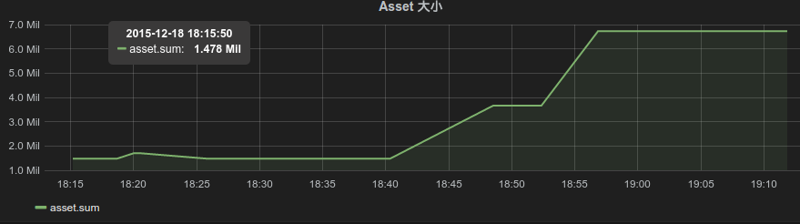
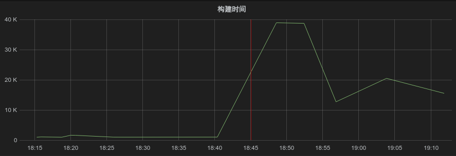
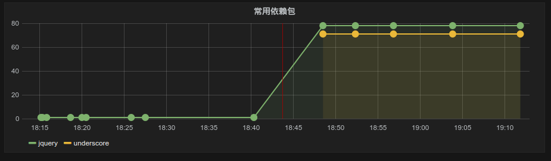
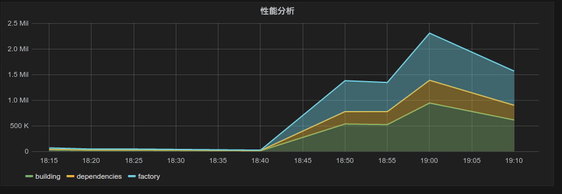

# webpack-performance
A webpack plugin to record important metrics during the building progress.

**alpha version**

## Dependency

* InfluxDB to record time series data
* Graphana to show grah

## Example

Track assets whole package size

Track build time

Track modules dependencies

Track profiling infomation

## License

MIT

